## Project Description
Rock, Paper, Scissors is a classic game of strategy and chance. a bot and a player simultaneously display one of three symbols: a rock, paper, or scissors. The rules are simple: a rock beats scissors, scissors cut paper, and paper covers rock. In this game, players must think carefully about their opponent's move to emerge victorious.

- Website consist of two pages
  - Home page: this includes an explaination of the game and the rules on how to play.

  - Game page:there are four sections

      - Game choices section: there are 3 buttons to chose from(Rock, paper and scissors)
      - results section: this displays the result of each player choices. red message is for computer, black for tie and green is for user.

      - Score section: this keep record of the game. this is to let each player knows of their results as they play the game.

      - restart section: here the user can chose to restart the game from scratch instead of keep refreshing the page. This function wipes all the previous results and brings the game back to zero.

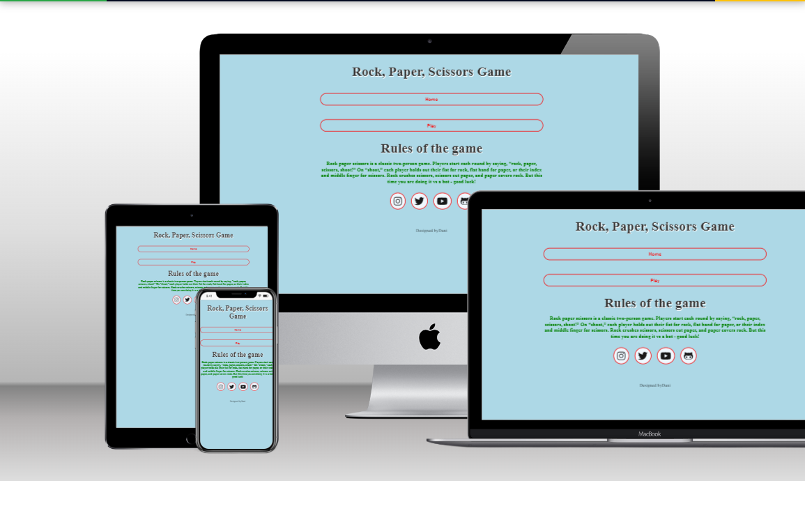 

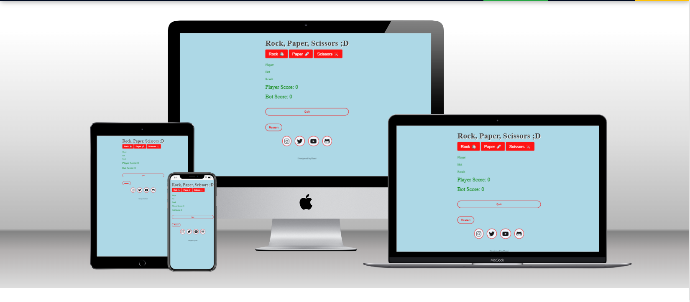 

# Table of Contents
1. [UX](#user-experience-ux)
    - [User stories](#user-stories)
2. [Design](#design) 
    - [Wireframes](#wireframes)
      - [Desktop](#desktop)
3. [Deployment](#deployment) 
4. [Features](#features)
   - [Home page](#home-page)
   - [Game Page](#game-page)

5. [Testing](#testing)
    - [Features Testing](#features-testing)
    - [Browser Testing](#browser-testing)
    - [Responsiveness](#responsiveness)
    - [Responsive testing](#responsive-testing)
    - [Manual Testing](#manual-testing)

6.   [Code Validation](#code-validation) 
      - [HTML Validation](#html-validation)
      - [CSS Validation](#css-validation)
      - [Javascript Validation](#javascript-validation) 

7.   [Lighthouse Test](#lighthouse-test) 
      - [Performance](#performance)

8.   [Libraries and Programs](#libraries-and-programs) 

9.   [Technologies Used](#technologies-used) 
      - [Languages](#languages)

10.   [Bugs & Solution](#bugs--solutions) 
      - [Solution](#solution)

11.   [Credits & Reference](#credits) 
      - [Code Used](#code-used)

12. [Media](#media)
12. [Acknowledgements](#acknowledgements)

# User experience (UX)
## User Stories

- As a user playing the game, I want the description of the game to be simple and clear to understand.
- I want the game buttons to be easy to use and navigate around.

- I want a message to display which options each player selected.

- I want to keep track of my score.
- I want to have the option to restart the game.
- I want to be able to return from the home page easily so I can go back and read the game rules and description.

## Design
The website consists of two pages. easy to navigate and smooth transition to go through each sections.
## Wireframes
  #### Desktop
  #### Home page

   #### Desktop 
 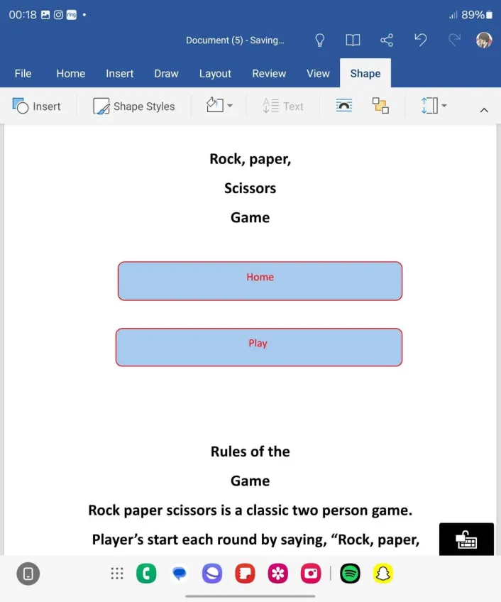
 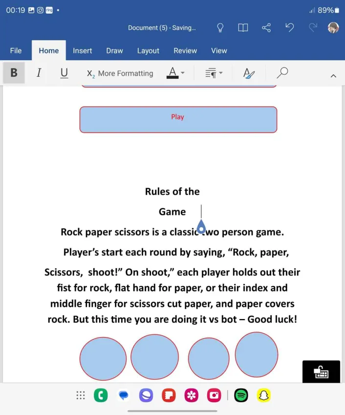
  #### Game page
 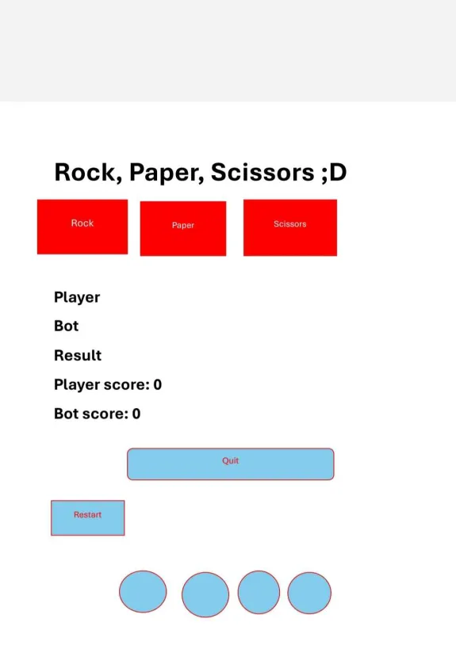

# Deployment
1. Select the project, and go to the Settings tab of your GitHub repository.
2. On the left-hand > under the Code and Automation section, select Pages.
3. under build and deployment >set 
Source to 'Deploy from Branch'.
The main branch is selected.
The folder is set to / (root).
4. Under Branch, click Save.
5. Go back to the Code tab. Wait a few minutes for the build to finish and refresh your repo.
6. On the right-hand side, in the Environments section, click on 'Github-pages'.

# Features
## Home Page
  
  - The home page Serves as a Guide Towards the pages that have The necessary information to play the game
  - The home page displays the game Title Rock paper scissors.
  - A brief description of the game and rules on how to play.
  - There are 4 buttons on the home page
    - Home button: display in Red colour.I have added an Grey colour when the user hover-on the home button.
    - play button: Displays in Red colour, when the user hovers on  the button it changes to grey This button brings the user to the game page.
## Game Page
  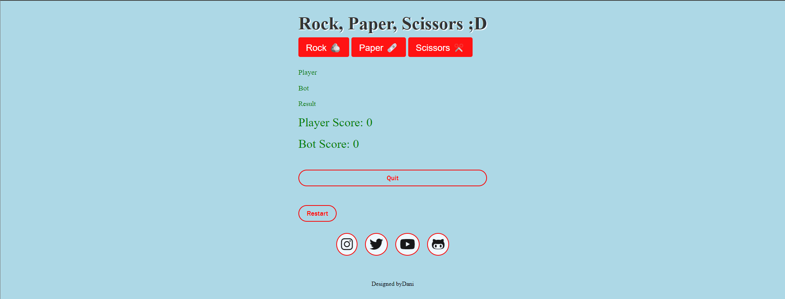
  - Game title
 - There are 5 buttons on the Game page
   - Quit button: Displays in red colour, when the user hover-on  the button it changes to grey. This button brings the user to the home page. 
   - Three buttons of game choice used the Rock Paper scissors symbol which represents Rock Paper and Scissors.
   - restart button: instead of the user refreshing the page to start a new game this functionality gives the user the power to clear the results and start fresh.
- player and computer choice section:
  - player choice shows first followed by the bot choice.
- Results section
  - If the computer wins the message is displayed in red colour
   
  - If the user wins the message is displayed in green colour
  
  - If the result is tied then the message is displayed in black colour.
   
- Game score section
  - when the computer wins the scoreboard is incremented by 1 and the colour is displayed in red. 
   - when the user wins the scoreboard is incremented by 1 and the colour is displayed in green. 
   
# Testing:
## Features Testing
All the features of the website have been tested to make sure it working as designed.

<table>
  <thead>
    <tr>
      <th>Feature</th>
      <th>Test case</th>
      <th>outcome</th>
    </tr>
  </thead>
  <tbody>
    <tr>
      <td>Navbar| Home</td>
      <td>click on home link</td>
      <td>This brings the user to home page</td>
    </tr>
    <tr>
      <td>Navbar| play game</td>
      <td>click on play game link</td>
      <td>This brings the user to the game page/ pass</td>
    </tr>
    <tr>
      <td>button| play </td>
       <td>click on play button</td>
      <td>This redirects the user to play the game/ pass</td>
    </tr>
    <tr>
       <td>button| game choices</td>
       <td> Click on each button and the button clicked is displayed</td>
      <td>/ pass</td>
    </tr>
    <tr>
      <td>restart button</td>
       <td>click on restart</td>
      <td> This set all the scores field back to zero/ pass</td>
    </tr>
  </tbody>
</table>

## Browser Testing
The website is tested across the below browsers to check the performance
<table>
  <thead>
    <tr>
      <th>Tested browser</th>
      <th>Appearance</th>
      <th>Responsiveness</th>
    </tr>
  </thead>
  <tbody>
    <tr>
      <td>Chrome</td>
      <td>All the links, images, and buttons appear good</td>
      <td>responsive design/ Good</td>
    </tr>
    <tr>
       <td>Edge</td>
      <td>All the links, images, and buttons appear good</td>
      <td>responsive design / Good</td>
    </tr>
    <tr>
      <td>Firefox</td>
      <td>All the links, images, and buttons appear good</td>
      <td>responsive design/ Good</td>
    </tr>
 
  </tbody>
</table>

## Responsive testing
<table>
  <thead>
    <tr>
      <th>Tested Device</th>
      <th>Site responsive  min-width: 600px</th>
       <th>Site responsive min-width: 768px</th>
        <th>Site responsive min-width: 992px600px</th>
    </tr>
  </thead>
  <tbody>
    <tr>
      <td>samsung s24 ultra</td>
      <td>Good/ nav Links are hiden. Menu icon display</td>
      <td>N/A</td>
      <td>N/A</td>
    </tr>
    <tr>
       <td>ipad tablet</td>
      <td>N/A</td>
      <td>Good/ nav Links are displayed</td>
      <td>N/A</td>
    </tr>
    <tr>
       <td>nest hub larger screen</td>
      <td>N/A</td>
      <td>N/A</td>
      <td>Good/ nav Links are displayed</td>
    </tr>
 
  </tbody>
</table>

## Manual Testing
  - Game's choice buttons
     - I clicked paper button and it displaying message rock each time.
     - I clicked rock button and it displaying message rock each time.
     - I clicked scissors button and it displaying message scissors each time.
   - computer's choice buttons
     - each time user select a move, computer is also generating a random numbers between 1-3. 
     1 = rock
     2 = paper
     3 = scissors
   - Game scores
     - I played the few times, the scoreboard is incrementing each time each players wins.
   - Restart button
    - clicked restart all the scores is wiped out and set the scores back to zero.

# Code Validation:
## HTML Validation
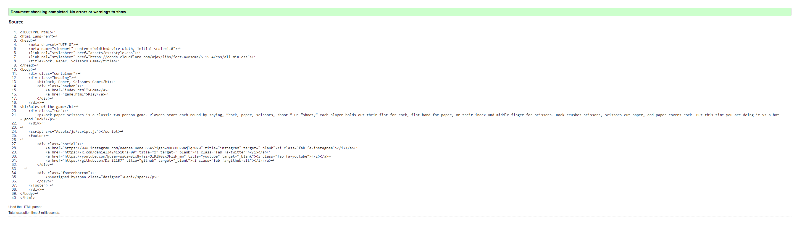

## CSS Validation

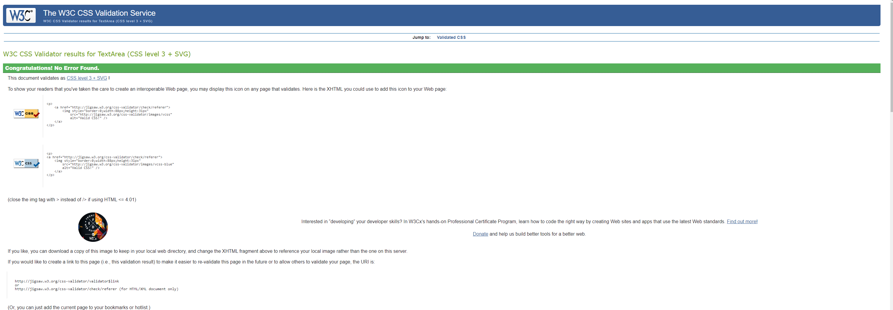

## Javascript Validation
- Errors and Warnings

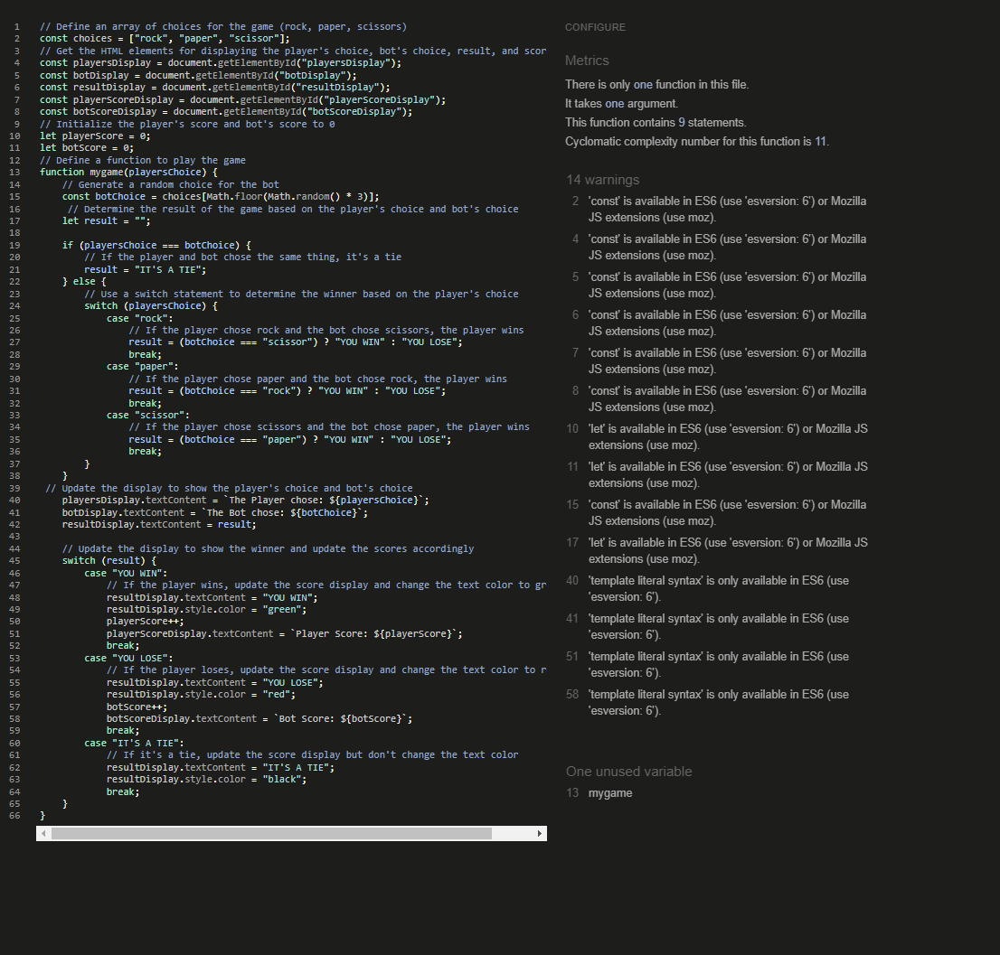
- Errors and Warnings fixed

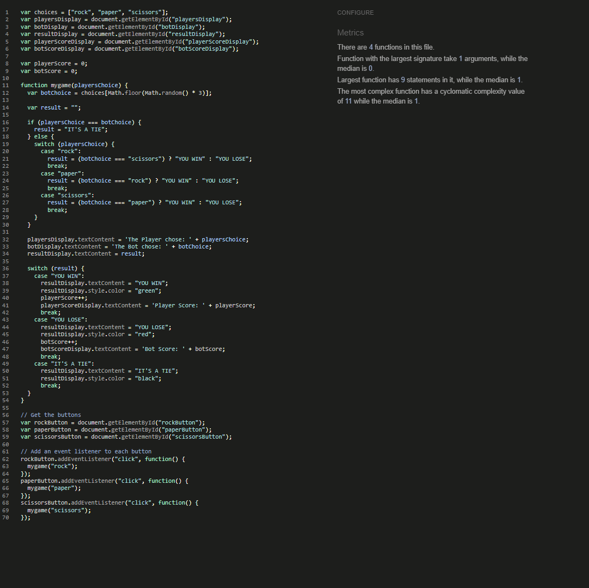

## Lighthouse Test
### performance 
 
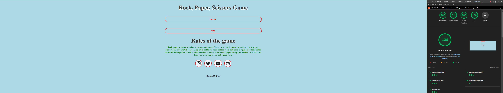

## Libraries and Programs:
- Used Visual Studio Code  as editor.
- Used Font Awesome for the social media icons.
- Used GitHub as version control to add, commit, and push to repository
- Used word for wireframes
- Google Chrome 
- MS Edge (For testing purposes)
- Firefox (For testing purposes)

# Technologies Used
## Languages
languages used: 
- HTML(page structures) 
- CSS3(styling of the page)
- Javascript (Functionalities)

## Acknowledgements
i would like to thank eveyone who helped me do this project

[Return to top](#project-description)